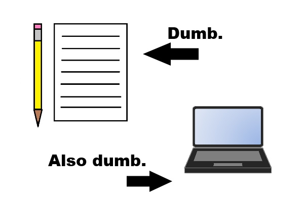
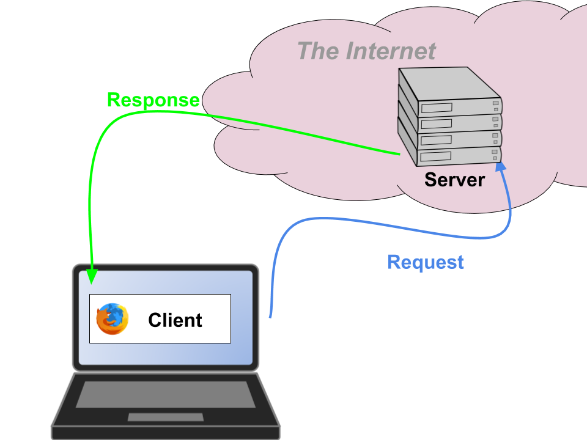
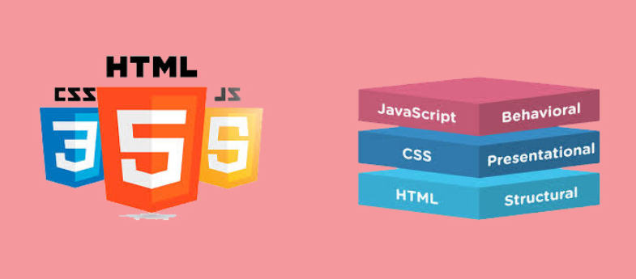

class: center, middle

# Coding IRL

---

# Me

- Hi, I'm Bob
- I write code, and people give me money for it
- It's pretty sweet

.right[]

---

# You've Started Programming!

- Rad.
--

- So... what are you going to do with that?

.right[]

---

# Coding isn’t a career: it’s a skill

- Just like writing, reading, and math: you use coding to get things done

--
- This means two things:
  - Programmers can be found in many, many different areas
  - Lots of people who aren’t “coders” can use coding as a tool

--
- It also means you code for totally non-career things, such as
  - fun
  - pranks
  - goof-em-ups
  - art

???

Imagine asking an X what they do, and they say "Y"?
- lawyer, I write
- accountant, I count
- surgeon, I cut people

---

# Me, redux

- ~~I write code, people give me money for it~~
- Actually, I...
    - Majored in English (not Computer Science)
    - Got a Masters of Arts in Linguistics
    - Learned to code in grad school to support my research
    - Discovered I liked coding and went use it in a LOT of different areas
--
- My jobs:
    - Conversational analysis for pharma market research
    - Campaign finance data collection and visualization
    - Building predictive models to recommend health insurance plans
    - Search engine for a mapping company
--
- What do these jobs have in common?
    - Used my coding skills
    - Learned new skills
    - **Learned about an entirely new domain**

???

There a lot to learn while building your coding skills, but to be a well-rounded developer you should also be exposing yourself to in-depth knowledge of other domains. You can use code in a million ways, and apply it to almost any other subject. In fact that's the best

---

# Coding with a purpose

It's fun at first, but just telling computers what to do gets pretty boring imo

```python

def hello_world():
    print "Hello World."

```

Writing code really gets interesting when you make computers do things _for a reason_.

It's also the best way to get better at coding:
- Apply your coding skill to a real problem in some domain.
- Learn something about the world, then express that knowledge through code.

---

# Going Shopping

Let's take a really simple domain: shopping at a grocery store. I know about this domain because I do it all the time. I can combine that domain knowledge with my storytelling skills to write this story for you:

> _Once upon a time, I went to Acme to buy food. I had a list of stuff in mind that I needed to get: apples, milk, bread, eggs, waffles and ice cream. I got a shopping cart and wheeled it inside._
>
> _Then I looked for the stuff I needed. When I found apples, I put them into my shopping cart. Same with the milk and bread, etc._
>
> _When I had found everything I needed, I went to the checkout. The cashier scanned all of the items and told me the total price. I gave them my credit card, paid, and took everything with me._
>
> _And they all lived happily ever after._

---

# Cool story, bro

... _riveting_, I know. But that story could've been way longer. I focused on some key details:
- I went to Acme **to buy food**.
- I had **list of stuff in mind that I needed to get**
- I got a **shopping cart**
- When I found things, I **put them into my shopping cart**.
- I **went to the checkout**.
- The cashier **scanned all of the items** and **told me the total price.**
- I **gave them my credit card, paid,** and took everything with me.

Things I didn't mention:
- the podcast I was listening to
- what color my socks were
- the name of the cashier
- how I got to the store, and how I got home

???

And that's just good storytelling: focus on what's important. Give us _just enough_ information to understand you. Every story contains a little world, but the writer decides what to highlight and how it works.

---

# What does this have to do with code?

**EVERYTHING**.
- Writing code is just another form of writing!
- Computers might be shinier and more expensive, but they're not any smarter than a pencil and paper.



???

When you write a story, the pen and paper don't know what you're writing. You're just using them to create a representation of your ideas.

The exact same thing is true when writing code: computers are piles of rocks and plastic. They have no idea what we're doing with them: they're just tools that we use to create a representation of our ideas. We say that they "think" but that's (so far) not true: all they can do is calculate and store information.

---

# Dev Stories

In fact, this is _so_ true, that some software developers actually chunk up their work into "stories." These are the to-do's that are necessary for building a product.


| story                                                      | needed                                |
|------------------------------------------------------------|---------------------------------------|
| I went to Acme **to buy food**.                            | `FoodItem` class                      |
| I had **list of stuff in mind that I needed to get**       | `ShoppingList` (editable, user-owned) |
| I got a **shopping cart**                                  | `ShoppingCart` class                  |
| When I found things, I **put them into my shopping cart**. | `ShoppingCart.add(FoodItem)`          |
| I **went to the checkout**.                                | `Checkout` interface                  |
| The cashier **scanned all of the items**                   | `Checkout.scan(ShoppingCart)`         |
| and **told me the total price.**                           | `Checkout.reportTotalCost()`          |
| I **gave them my credit card, paid,**                      | `Payment` service                     |

???

Imagine being the first person to build a website like Amazon. It's a lot like writing a story: you're going to start with a mostly-blank page. Computers don't know what a "store" is. Python doesn't have built-in object for "shopping cart." So to even get started, you have some to-do's:

---

# Shopping domain, in code

```python
class FoodItem:
    name: str
    price: float

class ShoppingList:
    items_to_buy: Mapping[FoodItem, boolean]

class ShoppingCart:
    items: list[FoodItem]

    def add(food: FoodItem):
        self.items.append(food)

class Checkout:

    def scan(cart: ShoppingCart):
        price = 0.0
        for item in cart.items:
            price += self.look_up_price(item)
        self.reportTotalCost(price)

    def reportTotalCost(price):
        print "That will be ${}".format(price)

```

???

So even when you're building something as boring as a store, you need to be creative. Literally, you need to create a little world. You have to put objects in it and have them interact with each other. You also need to have some of them interact with real live people or objects here in the real world.

---

# Writing well means learning

To write great code, you need:
- Deep understanding of the domain
- Ability to model concrete and abstract concepts
- Careful design of the interfaces and relationships involved
- **Curiosity: willingness to learn new things**
    - even about topics you _think_ you know everything about!

???

So to write good, useful code, you need some skills that have nothing to do with programming language syntax or how to set up your text editor. That stuff is always pretty well documented and you'll always have references at hand (or just Google the latest error meessage you saw). I personally think it's much more important to develop these skills first: levelling up as a coder will come with experience.

---

# Coding is creative

People who code are creating new things. Their code can
- represent the real world
- represent our understanding of real things
- help us to imagine things that aren't real

Coding is a skill that can be useful in business, art, science, engineering and more.

---
name: whatchuwant

# So... What do you want to create?

- [Websites](#websites)
- [Art](#art)
- [Mobile Apps](#mobile)
- [Robots](#robots)
- [Artificial Intelligence](#artificial-intelligence)
- [Games](#games)
- [Maps](#maps)
- [Data Visualizations](#data-visualizations)
- [Research/Analysis](#research-analysis)
- [Other fun hacks](#other-fun-hacks)

---
name: websites

# Websites

Working on building websites is a HUGE part of the tech industry. When you're writing code for the web, there aretwo major focus areas:

- client-side (aka "Frontend")
- server-side (aka "Backend")



---

# Websites: Server-Side

- Interfacing with databases
- Authenticating users
- Searching for information to be displayed
- Preparing content for the client
- Making data available directly through APIs

**Things to learn**
- Node.js, Ruby/Rails, Python
- Web Application Frameworks like express, Flask, Django
- Databases: SQL, Elasticsearch, Redis

---

# Websites: Client-side



**Things to learn:**
- Javascript, HTML & CSS
- Design principles

**Where to start:**
- [Getting Started With The Web](https://developer.mozilla.org/en-US/docs/Learn/Getting_started_with_the_web)
- [awesome-javascript-learning](https://github.com/micromata/awesome-javascript-learning)
- [Codepen.io](https://codepen.io/)

### [Back](#whatchuwant)

---
name: art

# Art

---
name: mobile-apps

# Mobile Apps

---
name: robots

# Robots

---
name: artificial-intelligence

# Artificial Intelligence

---
name: games

# Games

---
name: maps
# Maps

---
name: data-visualizations
# Data Visualizations

---
name: research-analysis
# Research/Analysis

---
name: other-fun-hacks
# Other fun hacks

---

# Thanks!

- questions: [blannon@gmail.com](mailto:blannon@gmail.com)
- this presentation: https://github.com/boblannon/coding-irl_20191213


.right[]
